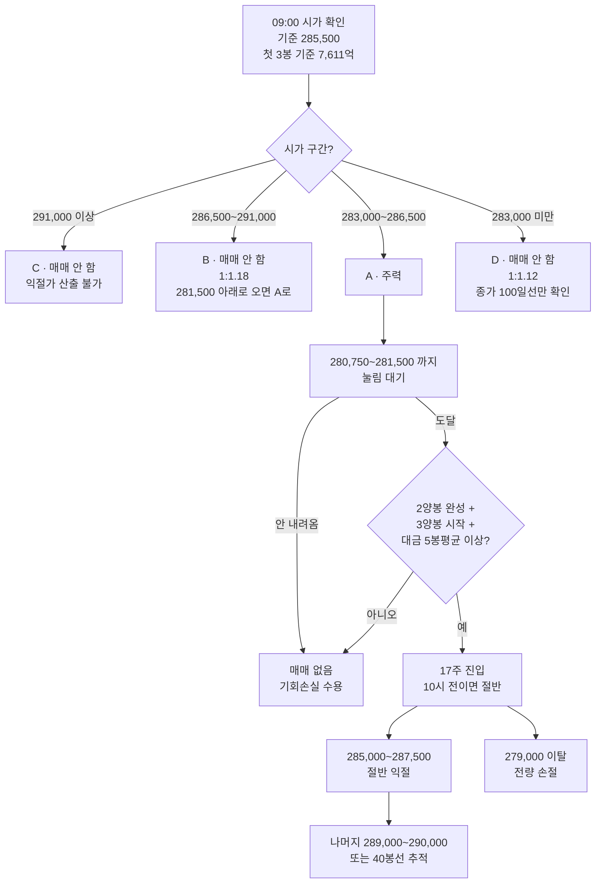

# 매매제안 — 2026/09/28 삼성전자

> [!abstract] 결론 한 줄
> **100일선(280,810)에 붙은 `280,750~281,500`(9/23 10:51~10:57봉) 한 자리에서만 ==17주 약 478만==.**
> 손익비 **1:1.82** → 절반 비중(평시 배정 1,000만 → **500만**, 그 96%). 익절 **285,000~287,500** 절반, 손절 **==279,000 이탈== 전량**.
> 위쪽 `283,000~284,000`은 근거가 더 두껍지만 **손익비 1:0.33으로 탈락** — 그 가격이 와도 0주다.
> 지수가 확인돼 **초강세면 배정 2,000만 → 절반 1,000만 → 35주**까지.

> [!danger]- 🔴 2026-09-28 시드 재설정 반영 + **초안의 10배 계산 오류 정정**
> **시드 재설정**(사용자 지정) — 총 **5,000만** · 종목당 절대 상한 **1,000만**(삼전·하닉만 **2,000만**) · **동시 3종목 · 총 노출 3,000만**. 모드별 배정은 삼전 **보수 500만 / 평시 1,000만 / 강세·초강세 2,000만**([[규칙후보#RC-16|RC-16]] 3차 개정).
> **정정** — 초안은 17주를 `약 4,780만 = 한도 1억의 48%`로 적었다. 실제로는 **17 × 281,125 = 4,779,125원 = 478만**이다(**10배 부풀림**). 옛 1억 한도 기준으로도 4.8%였다. 주식 수 17주 자체는 바뀌지 않았다 — 새 체계의 평시·절반 배정 500만이 마침 17주와 맞는다.

> [!warning]- 🔄 초안에서 바뀐 점 (손익비 게이트 신설 — 펼쳐 보기)
> 초안은 **1차 283,000~284,000 17주 + 2차 280,750~281,500 17주 = 34주**였다.
> [[규칙후보#RC-35|RC-35]]로 계산하니 **1차가 1:0.33**(익절 285,000까지 +1,500 vs 손절 279,000까지 −4,500)으로 기준(1:1.5)에 크게 못 미쳤다.
> 원인은 구조다 — **손절선 279,000은 1구간 아래 한 곳에 고정인데 1차 진입가가 그보다 1.6% 위**여서 손실 폭이 이익 폭보다 컸다.
> **익절을 늘리거나 손절을 올려 숫자를 맞추지 않았다**(RC-35 ③ — 고칠 것은 진입가뿐).

---

## 🎯 실행 카드

| 항목 | 내용 | 근거 요약 |
|:---|:---|:---|
| **주력 분기** | **A) 시가 283,000~286,500** | 전일 정규장 종가 285,500 기준 −0.9~+0.4% |
| **매수** | `280,750~281,500` · **17주(약 478만)** | 100일선 + 매물대 14% + 당일 저가 + 일봉 지지 5회 + 라운드피겨 = **5겹** |
| **매수 트리거** | 2양봉 완성 → **3양봉 시작 봉** | [[규칙후보#RC-28\|RC-28]] 대형주 / 봉 거래대금 ≥ 직전 5봉 평균 |
| **익절** | `285,000~287,500` **절반** → 나머지 `289,000~290,000` 또는 40봉선 추적 | 저항 1구간 매물 **3%뿐**(얇다) |
| **손절** | **`279,000` 이탈 → 전량** | 100일선 −0.6% · 진입 대비 **−0.9%** |
| **손익비 / 비중** | **1:1.82** / **17주 = 478만** | 평시 배정 1,000만 → 절반 **500만**의 **96%** · 종목 상한 2,000만의 24% · **시드 5,000만의 9.6%** |

> [!danger] 오늘 안 하는 것 — 4개 전부 "0주"
> | 자리·분기 | 손익비 | 왜 안 하는가 |
> |:---|:---:|:---|
> | 1차 `283,000~284,000` | **1:0.33** | 손절선까지 4,500 vs 익절까지 1,500 |
> | **B** 시가 286,500~291,000 | **1:1.18** | 진입 285,750 · 익절 289,000 · 손절 283,000 |
> | **C** 시가 291,000↑ | **계산 불가** | 위에 매물이 없어 ==익절가를 숫자로 잡을 수 없다== |
> | **D** 시가 283,000 미만 | **1:1.12** | 282,500~284,500 매물대가 **저항으로 돌아서** 익절이 283,500으로 내려간다 |
>
> **→ A분기 하나만 남았다.** 시가가 A 범위여도 280,750까지 안 눌리면 오늘 매매는 없다.

---

## 🧭 콜라보 지도

| 서열 | 가격대 | 겹친 근거 | 강도 | 역할 | 소구간 (분봉 시각) |
|:---:|:---|:---|:---:|:---:|:---|
| **저항 2** | 290,000 인근 | 라운드피겨 단독 · 매물 0 | 약 | 2차 익절 | — |
| **저항 1** | **285,000~287,500** | 매물 6,302억(**3%**) · 8/21 고가 285,000 거부 1회 · NXT 9/23 고가 286,500 | 중 | **1차 익절** | 285,000~285,500 (9/23 15:15봉 고가 285,500) |
| **지지 2** | **282,500~284,500** | 매물 **57,046억(23% — 최대)**, 9/23 하루 54,050억 = 그날의 78% · 3일선 283,166 · 40봉선 284,187 · 120봉선 283,391 | 강 | ⚠️ 방향 의존 | 283,000~283,500 (9/23 09:00봉 · 10:33~10:42봉 · 11:00~12:30봉 = **4회**) |
| **지지 1** | **280,000~282,500** | **100일선 280,810** · 매물 35,273억(14%) · 일봉 지지 5회 vs 거부 2회 · 라운드피겨 280,000 | 강 | **매수·손절** | **280,750~281,500** (9/23 10:51봉 281,000 → 10:54봉 **280,750** = 당일 저가) |
| 지지 3 | 277,500~280,000 | 9/22 매물 21,632억(9%) · 일봉 거부 2회·지지 1회 | 중 | 1구간 이탈 시 | — |
| 지지 4 | 270,000~275,000 | 9/21 매물 **59,884억** · 일봉 거부 5회 | 강 | 3일 상승분 반납선 | — |

> [!question]- 지지 2구간은 지지인가 저항인가 (접근 방향 문제)
> 일봉 이력은 **거부 3회(9/22·7/15·5/20) vs 지지 1회(6/11)**로 저항 쪽이 우세하다.
> 그런데 **9/23 종가 285,500이 처음으로 이 구간 위에 안착**했고, 같은 날 구간 안에서 **반복 지지 4회**가 나왔다.
> → **시가가 이 구간 위(A분기)면 지지**, 아래(D분기)면 **저항**으로 본다. 그래서 같은 가격을 사도 A는 통과하고 D는 탈락한다([[규칙후보#RC-35|RC-35]] ① 2 · §3 "매물 두꺼운 구간은 지지·저항 양면").

---

## ⚖ 손익비 게이트

> [!info] 계산 기준
> 진입 = **매수 구간 중앙값** · 익절 = **위쪽 첫 저항 덩이의 하단(285,000)** · 손절 = **제안서 단일 손절선(279,000)**
> 기준값 — **1:2↑ 정상 · 1:1.5~2 절반 · 1:1.5 미만 매수 안 함**

| 자리 | 진입(중앙) | 익절까지 | 손절까지 | 손익비 | 판정 |
|:---|---:|---:|---:|:---:|:---|
| **2차 280,750~281,500** | **281,125** | +3,875 (+1.38%) | −2,125 (−0.76%) | **1:1.82** | ✅ **절반 비중 17주** |
| 1차 283,000~284,000 | 283,500 | +1,500 (+0.53%) | −4,500 (−1.59%) | **1:0.33** | ❌ 탈락 |
| B분기 285,000~286,500 | 285,750 | +3,250 | −2,750 | **1:1.18** | ❌ 탈락 |
| D분기 280,750~281,500 | 281,125 | +2,375 (익절 283,500) | −2,125 | **1:1.12** | ❌ 탈락 |

> [!tip]- 참고 — 저항 구간 상단까지 끌면?
> 저항 1구간 **상단 287,500** 기준으로는 1차 1:0.89 · 2차 **1:3.00**이다.
> 다만 규칙은 **덩이 하단**으로 판정한다(도달 확률 우선). 285,000을 넘어선 뒤는 **추적 익절 문제**이고 진입 가부와는 별개다.

---

## 📋 장중 체크리스트

> [!todo] 09:00~09:30 — 순서대로
> - [ ] **시가 확인** → 위 Mermaid 분기표에서 A/B/C/D 판정
> - [ ] **첫 3봉 거래대금** 합계 ≥ **7,611억**? (9/21 10,307 · 9/22 5,740 · 9/23 6,785의 평균 [[규칙후보#RC-29|RC-29]])
> - [ ] **대장 재판정** — [[매매제안_20260928_삼성전기|삼성전기]] · [[매매제안_20260928_SK하이닉스|SK하이닉스]]와 상승률·거래대금 비교 ([[규칙후보#RC-25|RC-25]]) → **동시 1종목만**
> - [ ] **40봉선·120봉선 실제값 재계산** (9/23 마감 출발값 284,187 / 283,391)
> - [ ] **100일선 실제값 재확인** (추정 280,810 — 오늘 종가에 따라 변한다)

> [!todo] 진입 직전
> - [ ] 280,750~281,500 도달
> - [ ] **2양봉 완성 + 3양봉 시작 봉** ([[규칙후보#RC-28|RC-28]] 대형주 — 테마주처럼 2양봉 형성 중에 사지 않는다)
> - [ ] 그 봉 거래대금 ≥ **직전 5봉 평균**
> - [ ] 10시 전이면 **[[규칙후보#RC-27|RC-27]] 4조건 확인 + 계획의 절반(8~9주)만**
> - [ ] ==17주 초과 금지== — 추가 매수로 넘기지 않는다

> [!todo] 청산
> - [ ] 285,000 도달 → **절반 익절**
> - [ ] 나머지 289,000~290,000 또는 **40봉선 추적**
> - [ ] 282,500을 직전 5봉 평균 **1.8배 이상** 대금으로 이탈 → 절반 매도
> - [ ] 280,000을 같은 배수로 이탈 → **전량**
> - [ ] 279,000 이탈 후 3봉 내 280,000 미회복 → **전량** (오후 이탈은 즉시)

---

## 1. 시황

> [!warning] ⚠️ 판정 보류 — 사용자 판정 "반도체 강세"로 진행한다. 지수·수급·미장 데이터가 없다.

| 축 | 값 | 판정 |
|:---|:---|:---|
| 사용자 판정 | *"시황은 반도체가 강세인 거라고 내가 판단해서 종목 뽑아놓은 거야"* (2026-09-28) | 이 제안서는 **차트 기준** |
| 직전 확정 시황 | [[본인시황_2026#2026-09-23 (수) — 미장마감후\|본인시황 0923]] — 모드 **초강세 2일차**(9/22 종가 7,017.91 > 5일선 6,870.6 · 10일선 6,866.0) | 오늘은 3일차 후보 |
| 모드 | RC-12는 **코스피 종가** 기준인데 9/23 종가를 모른다 | **확정 불가 → 기본값 1억** |
| 종목 거래대금 | 9/23 정규장 **6.9조**(전체 9.1조), 3일 연속 9조 전후 | 고원 유지 |
| 양지수 거래대금 | 코스피·코스닥 각각의 값 없음 | **판정하지 않는다**(합산 금지) |

> [!missing] 확인 못 한 것 3개
> 1. **9/23 국장 마감 결과** — 코스피 종가 · 120일선 7,090 지지 여부 · 외국인 수급. 연휴로 `0923 국장마감후` 시황을 쓰지 않았다
> 2. **연휴 중 미장 3거래일**(9/24·25·26) — 시그널리포트 저장기 오류로 원본이 9/22까지만 있다
> 3. **9/24 미중 정상회담 결과** — 휴장 중에 열려 ==오늘 시가에 한 번에 반영==된다

> [!info]- 🗓 이벤트 (한국시간) → [[이벤트캘린더]]
> | 날짜(KST) | 이벤트 | 이 종목과의 연결 |
> |:---|:---|:---|
> | **9/28 오늘 시가** | 9/24 미중 정상회담 결과 반영 | 무역휴전 1년 연장 유력 vs **노딜 전망** 병존 |
> | **9/29(화) 아침** | 코리아소사이어티 갈라 — **이재용·최태원–젠슨 황 회동**(9/28 미국 저녁) | 종베·오버나잇의 **유일한 적극 근거** |
> | 9/29(화) 현지 | OpenAI DevDay | 반도체 전반 변수 |
> | 10월 중 | SK하이닉스 주주환원책 | 섹터 |

---

## 2. 일봉 판단

> [!success] 100일선을 갭으로 넘은 뒤 첫 되돌림에서 그 선을 지지로 지켜냈다 — 3일 연속 상승이라 초입은 아니지만 구조는 살아 있다.

1. **9/21~9/23 3일 연속 상승** — 종가 275,000 → 277,500 → 285,500(정규장), 9/21 저가 259,500 대비 **+10.0%**
2. **100일선 돌파·지지 전환** — 9/22 시가 279,000에 100일선(279,555) 위로 출발 → 9/23 저가 **280,750(10:54봉)**이 그날 100일선 **280,220**을 찍고 반등 → ==돌파 인정 → 전환 유지 2단계 통과==
3. **20일선이 60일선을 넘었다** — 9/28 추정 20일선 **262,675** > 60일선 **261,533**(9/22는 260,400 < 262,966) — 중기 배열의 첫 크로스
4. **거래대금** — 9/21 9.2조 · 9/22 8.7조 · 9/23 9.1조. **상승 + 유지**이므로 매수세 지속
5. **위가 비어 있다** — 285,000~287,499 매물이 4일 합계의 **3%뿐**. 기회이자 ==목표를 못 잡는 위험==

### 이평선 이격표

> [!note] 9/28 추정치 — "오늘 종가가 9/23 정규장 종가 285,500으로 끝난다면"의 값이다. **장중 갱신 필요**

| 이평선 | 값 | 이격 | 시각화 | 방향 |
|:---|---:|---:|:---|:---:|
| 3일 | 283,166 | **+0.82%** | `▏` | ↗ |
| **40봉선**(=1분봉 120분) | **284,187** | **+0.46%** | `▏` | ↗ |
| **120봉선**(=1분봉 360분) | **283,391** | +0.74% | `▏` | ↗ |
| **100일** | **280,810** | **+1.67%** | `▎` | ↗ |
| 5일 | 276,900 | +3.11% | `▍` | ↗ |
| 120일 | 268,990 | +6.14% | `███` | ↗ |
| 8일 | 268,062 | +6.50% | `███` | ↗ |
| 15일 | 265,833 | +7.40% | `███▌` | ↗ |
| 10일 | 265,500 | +7.53% | `███▌` | ↗ |
| 20일 | 262,675 | +8.69% | `████` | ↗ |
| 60일 | 261,533 | +9.16% | `████▌` | **↘** |
| 224일 | 210,655 | +35.5% | `██████████████████` | ↗ |

> [!important] 이격표에서 읽을 두 가지
> 1. 가격 **바로 아래 1% 안에 3일선·40봉선·120봉선 3개**가 몰려 있다 → 이 셋이 동시에 깨지면 2구간(282,500) 이탈이다
> 2. 100일선만 +1.67%로 가깝고 나머지 중기선은 6~9% 아래 → ==되밀릴 때 받쳐 줄 선이 100일선 하나뿐==이다

---

## 3. 전략 판정

| # | 전략 | 판정 | 근거 |
|:---:|:---|:---:|:---|
| 1 | **E4 대형주 돌파·지지 전환** | ✅ **채택 — 오늘 유일하게 실행** | 100일선을 갭+추가상승으로 돌파한 뒤 되돌림에서 지지 전환 = 1구간을 쓰는 전략 |
| 2 | E3 음봉매매 | ⚠️ 조건 성립, **손익비 탈락** | 9/23 조정 봉당 **557억** < 상승 봉당 **1,127억** = 속임수 음봉 성립. 그런데 2구간 진입은 1:0.33 |
| 3 | E12 이동평균선 | ⚠️ 조건 성립, **손익비 탈락** | 바닥 이평 1위 3일선(42%). 3일선 283,166이 2구간 안 → 같은 이유로 탈락. **3일선이 280,000대로 내려오는 날 다시 본다** |
| 4 | E1 종가베팅 | 조건부 | 9/29 갈라 반영일 기대 — 아래 종베 판정 |
| 5 | E10 섹터눌림 | 적용 가능 | 09:00~09:30 하닉·삼성전기와 비교(RC-25) |
| 6 | E9 급등주눌림 | ❌ | 5거래일 +9.8%, 카드 기준(100%)과 거리 |

- **시황 필터** — 모드 미확정. **보수로 판정되면 E1 종베·오버나잇 전부 제외**
- **양지수 거래대금 조건은 스스로 판정하지 않는다**(§3번 절차 ④) — 오늘 값을 주시면 반영한다

---

## 3-1. 차트 근거 표준 분석

### ① 파동 구조 — higher-high · higher-low 유지 중

| # | 시각·날짜 | 가격 | 판정 |
|:---:|:---|---:|:---|
| 1 | 9/21 | 저가 259,500 | 기점 |
| 2 | 9/22 | 저가 271,500 | 저점 높임 ✅ |
| 3 | 9/23 09:39~09:45봉 | 고가 285,000 | 고점 갱신 ✅ |
| 4 | 9/23 **10:54봉** | **저가 280,750** | 당일 저점 · 저점 높임 ✅ |
| 5 | 9/23 15:15~15:30봉 | 고가 285,500 | **고점 갱신** ✅ (동시호가 4,276억) |

→ [[규칙후보#RC-14|RC-14]] 2단 신호 **미발생**. 경고(못 넘김) 없음.

### ② 조정 성격 — 속임수 음봉(눌림) ✅

| 파동 | 구간 | 봉 수 | 봉당 대금 | 상승 대비 |
|:---|:---|---:|---:|---:|
| 상승 | 09:00~09:42 | 15 | **1,127억** | 100% |
| **조정** | 09:45~10:54 | 24 | **557억** | **49%** |
| 회복 | 10:57~15:18 | 88 | 392억 | 35% |

> [!caution] 단서 — 회복에 힘이 실리지 않았다
> 회복 구간 봉당 **392억**은 조정(557억)보다도 작다. **종가는 동시호가 4,276억이 만들었다.**
> → 오늘 시초 대금이 안 실리면 2구간이 저항으로 되돌아설 수 있다.

### ③ 매도 트리거 정량화

| 가격 | 조건 | 행동 |
|---:|:---|:---|
| **282,500** | 직전 5봉 평균 **1.8배 이상** 대금으로 이탈 | 절반 매도 |
| **280,000** | 같은 배수로 이탈 | **전량** |
| 279,000 | 이탈 후 3봉 내 280,000 미회복 | **전량**(손절선) |
| — | 1.8배 미만 이탈 | **노이즈 — 홀딩** (9/8 삼미 1.49배 → 이후 +5.1%) |

### ④ 이탈 허용폭·시간대 ([[규칙후보#RC-01|RC-01]])

| 시간대 | 허용 | 방식 |
|:---|:---|:---|
| 오전 09:00~11:00 | 279,000까지 −0.4% | 3봉 내 280,000 회복이면 홀딩 |
| 오후 13:00~ | **없음** | 280,000 이탈 즉시 컷 |

- 급락 봉을 그대로 받지 않는다 — **이탈 후 회복 확인** 방식(9/17 대한광통신 16,000 사례)

### ⑤ 억봉 익일 체크리스트 ([[규칙후보#RC-19|RC-19]] — 9/21 +5.8% 9.2조 기준)

| # | 항목 | 값 | 판정 |
|:---:|:---|:---|:---:|
| ⓪ | 급등 발생 시각 | 9/21 장중 내내(시가 263,500 → 고가=종가 275,000) | ✅ |
| ① | 갭 + 추가상승 + 대금 | 9/22 갭 +1.5% → 고가 283,500(+3.1%) · 8.7조 | ✅ |
| ② | 되돌림 비율 | 9/22 저가 271,500 = 상승분의 **29%** | ✅ 얕다 |
| ③ | 경과 일차 | **3일차** | △ 초입 아님 |
| ④ | 40봉선 유지 | 9/23 종일 40봉선 위 마감 | ✅ |

> [!check] 3종목 중 RC-19 체크가 가장 좋다
> [[매매제안_20260928_삼성전기|삼성전기]]는 ①②❌, [[매매제안_20260928_SK하이닉스|하이닉스]]는 ⓪①②❌다. 삼성전자만 ⓪①②가 전부 ✅다.

### 🧬 ⑥ 종목 성격 (급등 +5% · 표본 33건 · 24/11/15~26/09/21)

> [!quote] *"급등 뒤 −11% 되밀리고 바닥은 D+1과 D+3에 갈리며, 3일선이 반복 반등 자리다"*

| 지표 | 값 |
|:---|:---|
| 되밀림 (고점→바닥 중앙값) | **−11.3%** |
| D+1 종가 평균 | −0.1% |
| 바닥 날짜 | **D+3 33%** / D+1 27% / D+2 15% / D+4 15% / D+5 9% |
| 바닥 이평 | **3일선 42%** / 20일선 33% / 5일선 30% / 10일선 30% / 없음 24% |
| 반등 (바닥 뒤 3일 고가 중앙값) | **+13.3%** — D+1·3일선 바닥 9건은 +12.7% |
| 윗꼬리비 중앙값 | **0.05** |

**적용 4가지**
1. 윗꼬리비 0.05 = ==고가 근처에서 마감하는 성향== → 저항 앞 선제 매도의 필요가 낮다(9/23도 고가 마감). 나머지 절반을 추적으로 끌고 가는 근거
2. 바닥 이평 1위가 **3일선** → 3일선 283,166이 2구간 가점 근거. 단 오늘은 손익비로 탈락
3. **직전 급등일 9/21은 D+1(9/22) 바닥 · 3일선 · 반등 +5.5%** — 성격대로 움직였다
4. 되밀림 중앙값 −11.3%는 깊다 → **손절선을 넓히지 않고 비중으로 조절**(RC-01 유지)

---

## 4. 진입·청산 시나리오

### A분기 — 시가 283,000~286,500 · 주력

**1. 매수** — `280,750~281,500`(9/23 10:51~10:57봉)에서 **17주 약 478만** · **이 자리 하나만 쓴다**

1. **진입 조건** — 2양봉 완성 + **3양봉 시작 봉**([[규칙후보#RC-28|RC-28]] 대형주) · 3분봉 거래대금 ≥ 직전 5봉 평균[^1] · 10시 전이면 절반만([[규칙후보#RC-27|RC-27]])
2. **자리 근거 (5겹)** — 매물대 35,273억(14%) + **100일선 280,810** + 9/23 당일 저가 280,750(10:54봉) + 일봉 지지 5회 + 라운드피겨 280,000
3. **40분선 관계** — 40봉선 284,187 대비 **−1.0~−1.2% 아래**다. 분봉 이평만 보면 "공중 지지"지만 **100일선·매물대·당일 저가 3겹**이라 예외에 해당한다(§3-1-1 ⑦ 4, 2026-09-23 컨펌). 일봉 이평 인접 — **100일선 ±0.3%** ✅
4. **비중** — **17주 = 4,779,125원**. 모드 미확정이라 **평시 배정 1,000만**을 쓰고, 손익비 1:1.82가 1:1.5~2 구간이라 **절반 = 500만**([[규칙후보#RC-35|RC-35]] ② 2) → 그 **96%**를 쓴다. 1주 281,125원이라 18주면 506만으로 넘으므로 **17주에서 내림**([[규칙후보#RC-16|RC-16]] 4)
   - **지수가 확인돼 초강세면** 배정 2,000만 → 절반 1,000만 → **35주(약 984만, 시드의 19.7%)**까지 늘릴 수 있다. 단 **분할로** 채운다(원샷 금지)
   - 시드 **5,000만** 기준 : 이 포지션은 **9.6%**, 종목 절대 상한 2,000만의 **24%**

> [!failure] ❌ 283,000~284,000은 매수하지 않는다 — 관찰만
> 자리 근거는 **오히려 이쪽이 두껍다** — 매물대 57,046억(23%) + 3일선 283,166 + 9/23 반복 지지 4회, 40봉선 284,187이 바로 위에서 내려오는 중(유형 ②).
> 문제는 근거가 아니라 ==손절선과의 거리==다. 손익비 **1:0.33**.

**2. 익절** — `285,000~287,500` 절반 → 나머지 `289,000~290,000` 또는 40봉선 추적

1. 저항 근거 — 매물 **6,302억(3%)뿐**이어서 벽이 얇다. 8/21 고가 285,000 거부 1회 · NXT 9/23 고가 286,500이 유일한 참조점
2. 방식 — 초강세 ② 기준(2차 저항 절반 + 40봉선 추적, [[규칙후보#RC-23|RC-23]])을 쓰되 **모드 미확인이라 1차 익절을 앞당겼다**
3. ⚖ **손익비 판정 기준은 하단 285,000**이다. 그 위는 전부 추적 영역

**3. 손절** — `279,000` 이탈 · **전량**

1. 근거 — 1구간 하단 280,000의 −0.4%, **100일선 280,810의 −0.6%**. 이 아래는 "100일선 돌파 후 지지 전환"이라는 **진입 전제 자체가 깨진다**
2. 허용폭 — 정확값 컷이 아니라 **279,000을 깨고 3봉 안에 280,000 위로 회복 못 하면** 전량. 오후 이탈은 즉시. 진입 기준 **−0.9%**

### B·C·D분기 — 전부 매매 안 함

> [!fail]- 분기별 이유 (펼쳐 보기)
> - **B) 286,500~291,000** — 되돌림 매수 자리 285,000~286,500(중앙 285,750), 익절 289,000, 손절 2구간 하단 283,000 → **1:1.18** 미달. **관찰** : 되돌림이 281,500 아래까지 오면 A분기로 넘겨 처리(그때는 1:1.82)
> - **C) 291,000 이상** — 저항 1구간 위에 매물대가 없어 ==익절가를 숫자로 잡을 수 없다 → 손익비 계산 불가==. 3일 상승 뒤 4일차 갭이기도 하다. **관찰** : 40봉선이 올라와 붙은 뒤 3봉 안착하면 다음 날 후보
> - **D) 283,000 미만** — 같은 280,750~281,500을 사도, 시가가 2구간(매물 57,046억) **아래**면 그 구간이 **저항으로 돌아서** 익절이 283,500으로 내려간다 → **1:1.12** 미달. **관찰** : 100일선이 종가로 지켜지는지만 보고, 지켜지면 다음 날 A조건으로 재판정

### 종베 판정 (14:30~15:20)

| # | 항목 | 내용 |
|:---:|:---|:---|
| 1 | 대상 | 오전 진입이 없거나 이미 익절해 포지션이 없을 때 · 0-1이 **유효**라 가능 |
| 2 | 지지 **2겹 이상** 위 마감? | 3일선 **283,166** / 5일선 276,900 / 매물대 하단 **282,500** / 40봉선 **284,187** · 120봉선 **283,391** / 100일선 **280,810** |
| 3 | 막판 모양 | 14:30 이후 저가 낮추지 않고 종가 상승 마감 — **9/23이 정확히 그 모양**(14:30 284,500 → 15:30 285,500) |
| 4 | 시황·재료 | **9/29 아침 갈라·젠슨 황 회동 반영**이 유일한 적극 근거. **보수 모드면 금지** |
| 5 | 비중 | 오전분과 합쳐 **17주 초과 금지** |
| 6 | 2일차 청산 | 갭상승 09:05 전 일부 / 15분 무방향 타임컷 / 갭하락 기계적 손절 |

### 보유기간

1. **오전 진입분** — 원칙 **당일 청산**. 모드가 평시 이상으로 확인되고 종가가 **100일선 280,810 위**에서 마감한 물량만 오버나잇 1회([[규칙후보#RC-12|RC-12]] ⑤)
2. **종베분** — **9/29 오전 청산**. 갈라·회동이 국장에 반영되는 날이 매도 트리거
3. 9/29 OpenAI DevDay는 보유 중이면 확인 대상

---

## 5. 지지·저항 레벨

→ 위 [[#🧭 콜라보 지도|콜라보 지도 표]]와 동일. 매물대 원자료는 아래 부록.

---

## 6. 재료 판정

> [!abstract] 🌡 판정 — **유효** : 반도체 자체는 강하지만 **종목은 3일 연속 상승으로 초입이 아니다**

| 입력 | 값 |
|:---|:---|
| **테마** | 반도체 대형주 **3일차** · 서열 **대장**(9/22~23 하닉이 100일선에 거부당한 동안 삼전만 뚫었다) · 생애주기 ③ 확산 |
| **종목** | 0일차 **9/21**(+5.8%) → 오늘 **3일차** · 9/21 저가 대비 **+10.0%** · 5거래일 **+9.8%** |
| **거래대금** | 9/21 9.2조 → 9/22 8.7조 → 9/23 **9.1조(99%)** — 감소가 아니라 **고원** |
| **재료 4축** | 신선함 **△** · 연관성 ○ · 지속성 ○ · 확장성 ○ → 등급 **A** |
| **시황** | 사용자 판정 "반도체 강세" · 지수·수급·미장 미확인 → **우호(확인 전)** |

0. **재료 재확인** — 9/23 기준 ① **구글 TPU 정부 공급 타진(단독)** ② **eSSD 4분기 수요 상향(트렌드포스)** ③ 필라델피아 반도체 6거래일 연속 나스닥 상회. **연휴 4거래일이 지나 셋 다 신선도가 떨어졌고, 그동안의 미장 3거래일 내용은 확인되지 않았다**
1. 앞에 있는 촉매 — **9/29 갈라·젠슨 황 회동**
2. ⚠️ **미중 정상회담 결과가 오늘 시가에 한 번에 반영된다.** 무역휴전 연장이면 우호, "사진만 찍고 서명 없음"이면 시초 갭 반납 가능(9/22 같은 자리 갭 전량 반납 전례)

---

## 7. 리스크 체크

> [!info] 2026-09-28 시드 재설정 기준 — 총 시드 **5,000만** · 삼성전자 절대 상한 **2,000만** · 동시 3종목 · 총 노출 3,000만

| 항목 | 값 |
|:---|---:|
| 투입액 | 17주 × 281,125 = **4,779,125원** |
| 배정액(평시 1,000만 × 손익비 절반) | 500만 → **95.6%** |
| 종목 절대 상한 2,000만 대비 | **23.9%** |
| **시드 5,000만 대비** | **9.6%** |
| 보수 모드 배정(500만) 대비 | **95.6%** — 보수 판정이어도 17주는 한도 안 |
| 강세·초강세 배정(2,000만 → 절반 1,000만) | **35주**까지 (약 984만 · 시드 19.7%) |
| 최대 손실 | 손절 279,000 기준 −0.9% ≈ **−4.3만** |
| 최대 이익(285,000 전량 기준) | +1.38% ≈ **+6.6만** |
| **손익비** | **1:1.82** — 통과 자리가 하나뿐이라 배분 문제 없음 |
| 동시 보유 | [[매매제안_20260928_삼성전기\|삼성전기]] · [[매매제안_20260928_SK하이닉스\|하이닉스]]와 **동시 활성 금지** — 반도체 대형주 슬롯은 1종목(RC-15) |

> [!caution] 시드 5,000만에서는 손익 절대액이 작아진다
> 이 자리의 최대 손실 **4.3만** · 최대 이익 **6.6만**이다. 손익비 1:1.82는 맞지만 **금액 자체가 작다.**
> 초강세가 확인되면 35주(984만)로 2배가 되고, 그때 손실 −8.9만 · 이익 +13.6만이 된다.
> ⚠️ 이 사실이 ==비중을 임의로 늘리는 근거가 되지는 않는다== — 규칙을 바꾸려면 시드나 상한을 바꿔야 한다.

> [!danger] ⚠️ 비중 조급증 — 오늘 가장 나오기 쉬운 이탈
> [[규칙후보#RC-16|RC-16]] 위반 **8회**(최근 9/22 하닉 계획 2주 → **11주 = 550%**).
> **오늘 상한은 17주다**(초강세 확인 시에만 35주). 특히 ==손익비 탈락한 283,000~284,000에서 "일단 절반만" 사는 것==이 가장 나오기 쉽다 — **그 자리는 0주**다.
> 시드가 5,000만으로 줄었으니 **17주 = 478만은 시드의 9.6%**다. 절대 금액이 작아 보여 더 담고 싶어지는 것이 이번 체계의 새 함정이다.

---

## 8. 한계 고지

1. 이 제안은 확률적 판단이며 손실 가능성을 배제하지 않는다. 최종 결정과 책임은 사용자에게 있다.
2. 시황 축(지수·수급·미장·정상회담 결과)이 확인되지 않은 상태에서 **차트만으로** 작성했다. 시가·거래대금이 분기 조건과 다르게 나오면 이 문서의 숫자는 그대로 쓸 수 없다.
3. 이평선·매물대 수치는 **9/23 마감 기준**이며 개장 후 재계산이 필요하다.
4. 9/28 일봉 파일 첫 행(시가=고가=저가=종가 285,500, 거래대금 0)은 **프리마켓이 아니라 9/23 정규장 종가를 복사한 빈 행**이다. 이 행이 포함돼 산출된 이평선은 "오늘 종가가 285,500일 때의 값"으로 읽어야 한다.
5. ⚖ **손익비 게이트의 기회손실**(RC-35 ⑤) — 통과한 자리가 **A분기 280,750~281,500 하나뿐**이다. 시가가 A 범위여도 **여기까지 1.5% 이상 눌리지 않으면 오늘 매매는 없다.** 9/23에는 시초 대비 −1.5%까지 눌렸으므로 도달 가능한 폭이지만, 강하게 출발해 종일 안 눌리면 상승을 전부 놓친다. **이 규칙은 그 기회손실을 의도적으로 받아들이는 규칙이다.**
6. 종목 성격 표본 33건은 2024/11~2026/09의 **상승장 구간**에 치우쳐 있다. 되밀림 −11.3%·반등 +13.3%는 시황이 바뀌면 그대로 쓸 수 없다.

---

## 부록

> [!example]- 📊 9/23 정규장 3분봉 매물대 ([[규칙후보#RC-33|RC-33]] — (고+저+종)/3 × 봉 거래대금, 2,500원 폭)
> | 구간 | 4일 합계 | 비중 | 9/23 하루 |
> |:---|---:|---:|:---|
> | 285,000~287,499 | 6,302억 | 3% | 6,302억 (그날 9%) |
> | **282,500~284,999** | **57,046억** | **23%** | **54,050억 (그날 78%)** |
> | 280,000~282,499 | 35,273억 | 14% | 8,675억 (그날 13%) |
> | 277,500~279,999 | 21,632억 | 9% | — (9/22분) |
> | 275,000~277,499 | 12,887억 | 5% | — (9/22분) |
> | 272,500~274,999 | 36,592억 | 15% | — (9/21분) |
> | 270,000~272,499 | 24,548억 | 10% | — (9/21분) |
> | 267,500~269,999 | 15,634억 | 6% | — (9/21분) |
> | 260,000~262,499 | 25,997억 | 10% | — (9/18분) |
> | 257,500~259,999 | 12,244억 | 5% | — (9/18분) |
>
> 4일 정규장 합계 **251,752억** / 일별 : 9/18 38,241억(09:45부터만 수록) · 9/21 79,115억 · 9/22 65,369억 · 9/23 69,027억

> [!example]- 📊 일봉 거부·지지 이력 (최근 120거래일)
> | 구간 | 거부 | 지지 |
> |:---|:---|:---|
> | 285,000~287,499 | 1회 (8/21) | 2회 (7/7·5/21) |
> | 282,500~284,999 | **3회** (9/22·7/15·5/20) | 1회 (6/11) |
> | 280,000~282,499 | 2회 (5/19·5/8) | **5회** (9/23·7/10·7/2·5/14 …) |
> | 277,500~279,999 | 2회 (9/8·8/14) | 1회 (7/3) |
> | 275,000~277,499 | 2회 (9/9·7/22) | 0회 |
> | 272,500~274,999 | 1회 (8/24) | 0회 |
> | 270,000~272,499 | **5회** (9/10·9/7·8/27·8/13 …) | 1회 (9/22) |

> [!example]- 📊 첫 3봉 거래대금 ([[규칙후보#RC-29|RC-29]] 기준값 산출)
> | 날짜 | 첫 3봉 | 시가 | 3봉 고가 | 3봉 저가 |
> |:---|---:|---:|---:|---:|
> | 2026/09/21 | 10,307억 | 264,000 | 271,500 | 263,500 |
> | 2026/09/22 | 5,740억 | 283,000 | 283,500 | 280,000 |
> | 2026/09/23 | 6,785억 | 284,500 | 285,000 | 283,000 |
> | **직전 3일 평균** | **7,611억** | | | |

> [!example]- 📊 종목 성격 원자료 (급등 +5%, 표본 33건 중 최근 8건)
> | 급등일 | 등락% | 윗꼬리비 | D+1 종가% | 고점→바닥% | 바닥 | 바닥 이평 | 반등 3일% |
> |:---|---:|---:|---:|---:|:---:|:---|---:|
> | 26/06/24 | 9.3 | 0.06 | +5.9 | −15.7 | D+5 | 없음 | +4.3 |
> | 26/07/03 | 8.3 | 0.01 | +1.7 | −19.4 | D+3 | 없음 | +13.7 |
> | 26/07/09 | 5.8 | 0.37 | +1.4 | −19.5 | D+3 | 없음 | +18.5 |
> | 26/07/23 | 5.0 | 0.00 | −7.5 | −30.7 | D+4 | 없음 | +41.1 |
> | 26/07/31 | 21.3 | 0.19 | −9.8 | −14.8 | D+2 | 5일+8일 | +11.9 |
> | 26/08/12 | 7.1 | 0.13 | +1.9 | −11.3 | D+4 | 8일+10일+20일 | +15.6 |
> | 26/08/20 | 6.0 | 0.05 | −1.1 | −14.0 | D+3 | 20일 | +11.0 |
> | **26/09/21** | 5.8 | 0.00 | +0.9 | **−5.2** | **D+1** | **3일** | +5.5 |

> [!info]- 🗂 기본 정보·데이터 경로
> - **데이터** : `일봉분봉/완료/삼성전자일_20260928.xls`(일봉 601행, 2024/04/08~2026/09/28) · `일봉분봉/완료/삼성전자분_20260928.xls`(3분봉 901행, 2026/09/18 09:45~2026/09/23 19:57)
> - **제안일** : 2026-09-28(월) 장전 · 작성 기준 [[_매매제안방법]](2026-09-28판) · 분기 체계는 **기존 A/B/C 유지**([[규칙후보#RC-34|RC-34]]는 검증 전)
> - **현재 포지션** : 없음 — 9/17 매수 19주(평단 255,000)는 9/18 평균 260,000에 전량 청산(세전 +95,000 = +1.96%)
> - **관련 문서** : [[매매제안_20260922_삼성전자]] · [[복기_20260918_삼성전자]] · [[본인시황_2026]] · [[매매제안_20260928_삼성전기]] · [[매매제안_20260928_SK하이닉스]]

[^1]: 거래대금 없는 갭·추가상승은 밀릴 확률이 크다 — [D-월독프-진입-01] · [F-차읽남강의-리스크-03] *"갭상승했는데 물량이 안 터지면 밀릴 확률이 크다"* · [E7-월독프-판단-02]
