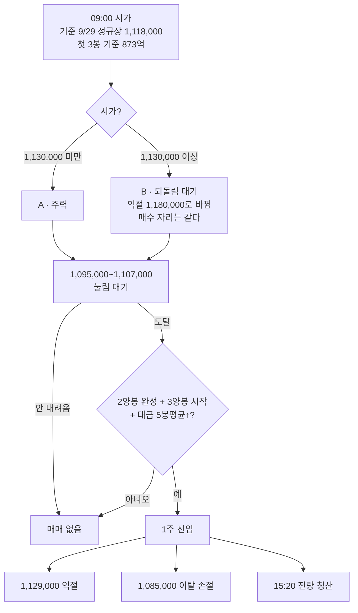

# 매매제안 — 2026/09/30 SK스퀘어

> [!abstract] 결론 (경로형)
> **시가가 1,130,000 아래로 열리고 → 첫 3봉 대금 873억 이상 → `1,095,000~1,107,000`(9/29 분봉 저가 반복 · 40·120봉선 · 3일선 가격점)까지 눌리고 → 2양봉 완성 + 3양봉 시작 봉(대금 ≥ 직전 5봉 평균) → ==1주(약 110만)==.**
> **하나라도 빠지면 매매 없음.** 익절 **1,129,000**(5일·120일선 콜라보) · 손절 ==1,085,000 이탈== · 손익비 **1:1.75 → 절반 비중** · **15:20까지 전량 청산**(마이크론 실적 전날)
> 반도체 대형주 슬롯은 **동시 1종목** — 4종목 중 오늘 **1순위**다(규칙을 그대로 통과한 자리 · 도달 확률 A · 1주 단가 110만)

> [!warning] ⚠️ 가정 — 보수 모드 진입 자리
> RC-12 보수 ①은 "평시보다 **한 단계 아래** 지지"다. 그대로 적용하면 매수 자리가 **대각 하단·100만(약 1,011,000, 시가 대비 −10%)**으로 내려가 도달 확률 약 5% → 매매 안 함이 된다.
> 이 제안서는 **평시 기준 1구간(띠 안 분봉·이평 콜라보)을 손익비·도달 확률로 거른 결과**를 쓰고, 보수 모드는 **비중 절반 · 당일 청산**으로만 반영했다. **엄격 적용 여부는 사용자 결정.**

---

## 🧭 국면 판단 (사용자 확정 9/30)

![[20260930_SK스퀘어.png]]

| 항목 | 내용 |
|:---|:---|
| **국면** | **⑧ 대각 상승 — 상단 119만 찍고 내려오는 중**(사용자) · 저점을 올리는 모습 |
| **상단** | **119만** — 9/08 1,199,000 · 9/23 1,196,000 · 9/28 1,201,000 **3회 거부** |
| **지지저항 띠** | **100만~119만**(사용자) — 띠 안 어디서든 지지 가능, 정밀 타점은 분봉·이평으로 |
| **대각 하단** | 8/11 901,000 → 9/03 947,000 → 9/16 988,000 · 기울기 **+3,410원/일** → **9/30 ≈ 1,011,000** = 100만 하단과 겹친다 |
| 현재가 위치 | 9/29 정규장 **1,118,000**(NXT 1,122,000) — 상단 찍고 띠 가운데로 내려오는 중 |
| 클로드 9/29 판정과 차이 | 클로드는 **박스 중단(①)**으로 봤다 — 옛 방식이 대각선을 안 봤다. 상단 119만은 일치 |

## 🎯 실행 카드

| 항목 | 내용 | 근거 |
|:---|:---|:---|
| **주력 분기** | **A) 시가 1,130,000 미만** | NXT 1,122,000 · 야간선물 +1.08% → 시초 약 1,125,000~1,130,000 |
| **매수** | `1,095,000~1,107,000` · **1주(약 110만)** | 9/29 분봉 저가 **1,103,000(17회)** · 1,095,000(11회) + 40봉선 1,101,900 · 120봉선 1,104,992 + **3일선 가격점 1,107,000** = 4겹 |
| **트리거** | 2양봉 완성 → **3양봉 시작 봉** | RC-28 대형주 · 봉 대금 ≥ 직전 5봉 평균 · 10시 전이면 RC-27 4조건 |
| **익절** | **1,129,000**(5일 1,130,200 · 120일 1,129,062 콜라보) 전량 | 보수 ② 한 단계 아래 저항 / 시가 1,130,000↑면 익절 = **1,180,000**(상단 띠 하단) |
| **손절** | **1,085,000 이탈** → 3봉 내 미회복이면 전량 | 9/29 저가 1,087,000(09:00) 아래 · 진입 대비 −1.5% |
| **손익비 / 비중** | **1:1.75** / 1주 = 110만 | 1:1.5~2 = 절반 → 125만의 **88%** · 시드 5,000만의 **2.2%** |

> [!danger] 오늘 안 하는 것
> | 자리·분기 | 이유 |
> |:---|:---|
> | 시초 추격(1,120,000~1,130,000) | 5일·120일선(1,129~1,130k)이 바로 머리 위 — 손익비 계산 불가 |
> | 1,107,000~1,120,000 사이 | 3일선 1,112,000 · 60일선 1,112,900이 머리 위 · 분봉 근거 없음 |
> | **대각 하단·100만(약 1,011,000)** | 도달 확률 약 5%(시가 대비 −10%) — 오늘 자리가 아니다. 종가로 대각 하단 이탈이면 **국면 붕괴** |
> | 오버나잇 | **마이크론 실적 전날** — 15:20까지 전량 |

## 🗺 콜라보 지도

| 구간 | 가격 | 겹친 근거 | 역할 |
|:---|:---|:---|:---|
| 저항 2 | **1,180,000~1,201,000**(선 119만) | 일봉 3회 거부(사용자 상단) | 2차 익절 |
| 저항 1 | **1,129,000~1,131,000** | 9/30 하루 한정 5일선 1,130,200 · 120일선 1,129,062 | **1차 익절** |
| (공백) | 1,113,000~1,128,000 | 9/28 하락 체결대(1,090~1,201) 일부 | — |
| 머리 위 | 1,112,000~1,113,000 | 3일선 1,112,000 · 60일선 1,112,900 | 진입 뒤 첫 관문 |
| **지지 1** | **1,095,000~1,107,000** | 분봉 저가 1,103,000(17회) · 1,095,000(11회) · 40봉선 1,101,900 · 120봉선 1,104,992 · 3일선 가격점 1,107,000 | **매수** |
| 지지 2 | 1,072,000~1,090,500 | 9/29 일봉 저가 1,072,000 · 10일선 1,090,500 · 20일선 1,076,400 | 손절 아래 |
| 띠 하단 | **988,000~1,011,000** | 사용자 100만 · **대각 하단 ≈ 1,011,000** · 9/16·9/17 저가 | 국면 방어선 |

## ⚖ 손익비 · 도달 확률

| 자리 | 진입(중앙) | 익절 | 손절 | 손익비 | 도달 확률 | 판정 |
|:---|---:|---:|---:|:---:|:---:|:---|
| **A 1,095,000~1,107,000** | 1,101,000 | 1,129,000 (+28,000) | 1,085,000 (−16,000) | **1:1.75** | 시가 1,128,000 → −1.9% 필요 → **약 74%** | ✅ **절반 · 1주** |
| B 같은 자리(시가 1,130,000↑) | 1,101,000 | 1,180,000 (+79,000) | 1,085,000 | 1:4.9 | 시가 1,135,000 → −2.5% → 약 64% | 절반(도달 B) · 1주 |
| 시초 추격 | 1,125,000 | 1,129,000 | 1,105,000 | 1:0.2 | — | ❌ |
| 대각 하단 1,011,000 | 1,011,000 | 1,072,000 | 985,000 | 1:2.3 | **약 5%** | ❌ 오늘 아님 |

- 도달 확률 = SK스퀘어 최근 120거래일 **시초→저가** 분포 : −1% 이상 87% · −1.5% 78% · −2% 72% · −3% 56% (중앙 −3.71%)

## 📋 체크리스트

> [!todo] 09:00~09:30
> - [ ] 시가 — A(1,130,000 미만) / B(이상)
> - [ ] 첫 3봉 대금 ≥ **873억**? (9/29는 431억으로 절반)
> - [ ] **대장 재판정** — 삼전·하닉·삼성전기와 상승률·대금 비교, **동시 1종목**
> - [ ] SK하이닉스 방향 — 지주사라 하닉을 따라간다

> [!todo] 진입 직전
> - [ ] 1,095,000~1,107,000 도달
> - [ ] 2양봉 완성 + **3양봉 시작 봉** · 그 봉 대금 ≥ 직전 5봉 평균
> - [ ] ==1주 초과 금지== — 1주 110만이 절반 배정 125만의 88%

> [!todo] 청산
> - [ ] 1,129,000 → 익절(B분기면 1,180,000)
> - [ ] 1,085,000 이탈 후 3봉 내 미회복 → 전량
> - [ ] **15:20 전량** — 마이크론 실적 전날

## 🌡 시황 · 재료

> [!info] [[본인시황_2026#2026-09-30 (수) — 미장마감후|본인시황 0930]] 요약
> - **보수 4일차** · 필라 **+1.32%**(나스닥 앞섬 회복) · 미10년 5.240(고점) · WTI 88.93(90 이탈) · 야간선물 **+1.08%**
> - 재료 : **HBM 2027 ASP +121%** · 하닉 윈팩 외주 확대 / 역풍 : 금감원 **삼전닉스 신용융자 15% 관리** · 전일 외국인 현물 −3.08조 → **장중 수급 확인 주의**(진입 판단은 사용자)
> - SK스퀘어 = SK하이닉스 지주사 — **하닉 방향이 곧 이 종목 방향**. 솔리다임 상장설(하닉 손자회사)은 지주 할인 논란과 겹친다

## 📏 비중 · 리스크

| 항목 | 값 |
|:---|---:|
| 등급 | 일반(그 외) — 보수 250만 · 평시 500만 · 절대 상한 1,000만 |
| 배정액 | 보수 250만 × 손익비 절반 = **125만** |
| 투입 | 1주 × 1,101,000 = **1,101,000원 (88%)** |
| 시드 대비 | **2.2%** |
| 최대 손실 / 이익 | −1.5% ≈ **−1.6만** / +2.5% ≈ **+2.8만** |
| ⚠️ 비중 조급증 | RC-16 위반 8회. **2주 = 220만 = 배정의 176%** — 한 주만 더 사도 넘는다 |

## ⚠️ 한계

- 국면·띠는 **사용자 확정(9/30 아침)**이고, 띠 안의 분봉·이평 콜라보는 클로드가 매칭했다
- 9/30 이평은 **9/30 종가를 9/29 종가로 가정한 값** — 장중 조금씩 달라진다
- 1,129,000 익절은 **이평(하루 한정)** 저항이라 일봉 거부 이력보다 약하다 — 보수 ② "한 단계 아래 저항"으로 채택
- 반도체 대형주 슬롯 1종목 — 오늘 대장 재판정 결과에 따라 **다른 종목으로 바뀔 수 있다**

> [!example]- 부록 — 데이터
> - 데이터 : `일봉분봉/SK스퀘어{일,분}.xls`(9/29 업로드 → 제안 후 `완료/…_20260929.xls`로 이동)
> - 9/29 일봉 : 시 1,099,000 · 고 1,123,000 · 저 1,072,000 · 종(NXT 포함) 1,122,000 · 대금 6,252억
> - 9/29 3분봉 : 시 1,096,000 · 고 1,121,000(09:39) · 저 1,087,000(09:00) · 정규장 종 1,118,000 · 대금 5,693억
> - 흐름 : 09:00 1,103,000 → 09:30 1,114,000 → 10:30 1,117,000 → 12:00 1,106,000 → 13:00 1,096,000 → 14:30 1,097,000 → 15:18 1,116,000
> - 첫 3봉 : 9/22 895억 · 9/23 1,153억 · 9/28 1,036억 · 9/29 431억 → 직전 3일 평균 **873억**
> - 9/30 이평(9/30 종가 = 9/29 종가 가정) : 3일 1,112,000 · 5일 1,130,200 · 10일 1,090,500 · 20일 1,076,400 · 60일 1,112,900 · 120일 1,129,062 · 224일 805,795 · 3일선 가격점 1,107,000
> - 스윙 : 저점 7/30 764,000 · 8/11 901,000 · 9/03 947,000 · 9/16 988,000 / 고점 8/05 1,182,000 · 8/18 1,265,000 · 9/08 1,199,000 · 9/28 1,201,000
