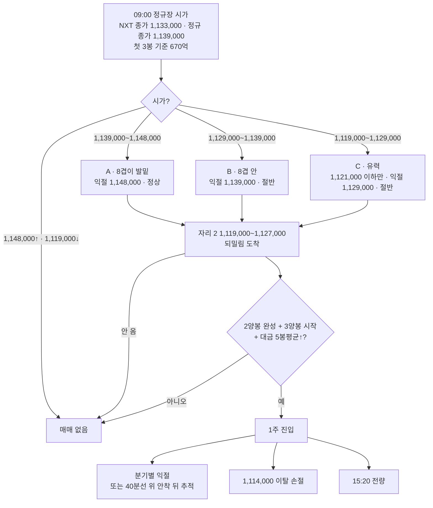

# 매매제안 — 2026/10/01 SK스퀘어

> [!abstract] 결론 (경로형)
> **시가가 1,148,000 아래로 열리고 → 첫 3봉 대금 670억 이상 → 9/30 오후 박스 하단 `1,119,000~1,127,000`(전일 저가 · 3.5일선 가격점 · 9/29 NXT 고가)에 되밀려 도착 → 2양봉 완성 + 3양봉 시작 봉(대금 ≥ 직전 5봉 평균) → ==1주(약 112만)==.**
> **하나라도 빠지면 매매 없음.** 손절 ==1,114,000 이탈==(전 분기 공통) · **익절은 시가가 정한다** — 시가가 머리 위 8겹 콜라보(1,129,000~1,135,000) **위면 1,139,000~1,148,000 / 아래면 1,129,000** · **15:20까지 전량 청산**
> 야간선물 −0.61% 기준 **유력 분기는 C(시가 1,119,000~1,129,000)** — 이 경우 매수는 **1,121,000 이하 체결만**, 손익비 1:1.50 경계라 **절반(1주)**

> [!warning] ⚠️ 가정 두 가지
> 1. **국면·띠는 9/30 사용자 확정값을 그대로 썼다** — 9/30 봉(1,119,000~1,163,000)이 띠 100만~119만 안에 있어 국면이 바뀌지 않았다고 봤다. 1단계 재보고는 생략했다(사용자 요청 "매매제안 해줘")
> 2. **보수 ①(한 단계 아래 지지)은 9/30과 같이 엄격 적용하지 않았다** — 평시 콜라보를 손익비 · 도달 확률로 거르고, 보수는 비중 절반 · 당일 청산으로 반영

---

## 🧭 국면 판단 (사용자 확정 9/30 · 10/01 유지)

![[20261001_SK스퀘어.png]]

| 항목 | 내용 |
|:---|:---|
| **국면** | **⑧ 대각 상승 — 상단 119만 찍고 내려오는 중**(사용자) · 저점을 올리는 모습 |
| **상단** | **119만(1,180,000~1,201,000)** — 9/08 · 9/23 · 9/28 **3회 거부** |
| **띠** | **100만~119만** — 띠 안 어디서든 지지 가능, 정밀 타점은 분봉·이평 |
| **하단 100만** | 988,000~1,010,000 — **5월 · 8월 · 9월 세 번, 14~17회 방어**(5/18 꼬리 10.6% · 8/19 7.9% · 8/25 7.0% · 9/04 · 9/14~16 — 9/30 사용자 지적 반영) |
| **대각 하단** | 8/11 → 9/03 → 9/16 저가 · +3,410원/일 → **10/01 ≈ 1,014,661** = 100만 하단과 겹친다 |
| 반월 진단 | 최근 3반월 947,000~1,265,000 · 현재가 1,133,000 = **58% 지점**(띠 중상단) |
| 9/30 봉 | 시 1,130,000(NXT) · 고 1,163,000 · 저 1,119,000 · 종 1,133,000(NXT) / 정규장 1,148,000 → 1,139,000 — **갭 반납 뒤 하루 한정 이평 콜라보에서 4회 방어** |

## 🎯 콜라보 자리 × 도착 흐름

![[20261001_SK스퀘어_분봉콜라보.png]]

| 자리 | 가격 | 겹친 근거(최근성 순) | 겹 | 좋은 도착 흐름 | 대응 |
|:---:|:---|:---|:---:|:---|:---|
| 저항 2 | **1,139,000~1,150,000** | 전일 정규 종가 1,139,000 · **NXT 애프터 고가 1,139,000** · 9/30 14:30대 되밀림 1,141,000~1,143,000 · 전일 정규 시가 1,148,000 · 라운드 1,150,000 | 5 | — | **B분기 익절**(하단 1,139,000) |
| 저항 3 | 1,163,000 | 전일 고가(09:33) | 1 | — | 참고 — 저항 덩이 아님 |
| **1(상단)** | **1,129,000~1,135,000** | 전일 NXT 종가 1,133,000 · NXT 시가 1,130,000 · **2.5일선 가격점 1,131,000 · 3일선 가격점 1,129,500** · 40분선 1,131,600 · 120분선 1,134,200 · 10/01 5일선 1,133,000 · 120일선 1,134,483 | **8** | 시가가 **위(1,139,000↑)에서 열려 오전에 되밀려 도착** · 되밀림 대금 감소 | **A분기에선 발밑 지지**(머리 위 → 발밑 전환, 9/30 복기 교훈) — 단 손익비 1:0.89라 **관찰만** / **시가가 아래면 머리 위 저항 = C분기 익절** |
| **2(하단)** ⭐ | **1,119,000~1,127,000** | **전일 저가 1,119,000(12:45)** · 2일 전 고가 1,121,000 · **3.5일선 가격점 1,122,900** · 9/29 NXT 고가 1,127,000 · **9/30 11:33~13:09 박스(4회 방어)** · 일봉 띠 | 5 | ① 오전에 1(상단) 위로 올랐다가 되밀려 도착 = **정상** ② 시가가 여기서 열려 **시가 이탈 후 바로** = **절반(P3)** | **매수 자리** — 전 분기 공통 |
| 3 | 1,095,000~1,106,000 | 10/01 60일선 1,105,333 · 10일선 1,103,900 · **9/29 분봉 저가 반복 1,103,000(17회) · 1,095,000(11회)** | 4 | 갭 −1.2%↓ 출발 뒤 오전 되밀림 | **관찰만** — 손익비 1:1.19 |
| 4 | 1,082,000~1,087,000 | 20일선 1,082,000 · 9/29 정규 저가 1,087,000(09:00) | 2 | — | 손절 아래 |

- 문장으로 : **"오전에 올랐다가 밀린다면 `1,119,000~1,127,000`이 전일 저가이면서 3.5일선 가격점이면서 9/30 오후 박스 바닥이다 — 오전 도착이면 정상, 시가가 여기서 열려 바로 밀려 들어오면 절반, 오후 도착이면 축소."**
- **반대 방향** : 밀렸다가 오를 때 막히는 곳은 **`1,129,000~1,135,000`(8겹)** — 시가가 이 아래면 첫 저항이다. 그 위는 `1,139,000~1,150,000`
- 1(상단)과 2(하단)는 **0.2% 떨어진 맞닿은 콜라보**다 — 합치면 1,119,000~1,135,000(1.4%, 대형주 한 덩이 기준 안). 도구는 둘로 갈랐고, 이 제안서는 **"한 덩이, 소구간 둘"**로 읽었다(§5 ⚠️ 판단)
- 청산은 **두 가지를 모두** : 고정 익절(분기별) / **40분선(전일 마감 1,131,600) 위로 올라선 뒤 추적** — 눌림 진입 직후에는 40분선 이탈을 청산 기준으로 쓰지 않는다(RC-23 · RC-31 ③)

## 🎯 실행 카드

| 항목 | 내용 | 근거 |
|:---|:---|:---|
| **분기 기준** | 정규장 09:00 시가 · 기준 NXT 종가 1,133,000 / 정규 종가 1,139,000 · 첫 3봉 **670억** | 첫 3봉 = 9/28 1,036 · 9/29 431 · 9/30 543억 평균 [RC-29] |
| **유력 분기** | **C) 시가 1,119,000~1,129,000** | 야간선물 −0.61% → 1,133,000 × 0.994 ≈ 1,126,000 |
| **매수** | `1,119,000~1,127,000` · **1주**(C분기는 **1,121,000 이하**) | 자리 2 — 5겹 |
| **트리거** | 2양봉 완성 → **3양봉 시작 봉** · 그 봉 대금 ≥ 직전 5봉 평균 | RC-28 대형주 · 10시 전이면 RC-27 |
| **익절** | A **1,148,000** / B **1,139,000** / C **1,129,000** — 또는 40분선 위 안착 뒤 추적 | 시가가 정하는 첫 저항 덩이 하단 [RC-35] |
| **손절** | **1,114,000 이탈** → 3봉 내 미회복이면 전량 | 전일 저가 1,119,000 · 박스 바닥 붕괴 |
| **보유** | **15:20 전량** | 보수 · 10/02 금요일 · 10/02 밤 미 고용보고서 |

> [!danger] 오늘 안 하는 것
> | 자리·분기 | 이유 |
> |:---|:---|
> | **시초 추격** | 시가 바로 위가 8겹(1,129,000~1,135,000) 또는 저항 덩이(1,139,000~1,150,000) |
> | 자리 1(상단 8겹) 매수 | A분기에서도 손익비 **1:0.89** — 익절(1,148,000)까지 16,000 vs 손절까지 18,000 |
> | 자리 3 `1,095,000~1,106,000` | D분기(시가 1,119,000↓)에서 익절 1,119,000까지 **1:1.19** — 관찰만 |
> | **시가 1,148,000 이상** | 익절가가 시가 아래 — 추격만 남는다 |
> | 오버나잇 | 보수 · 금요일 전날 · 10/02 밤 미 고용보고서 |

## 📋 전략 요약

0. **채택 전략** : ① 콜라보 되밀림 2양봉(자리 2 · RC-28) / 적용 가능(언급만) : 머리 위 → 발밑 전환(RC-34 1순위 — A분기 자리 1, 손익비 탈락)
0-1. 🌡 **재료·시황 : 유효** — 시황은 역풍(보수 6일차 · 마이크론 무반응 · 30년물 신고점 · 원화 약세), 재료는 대기(**SK하이닉스 60조↑ 주주환원 10월 중 = 지주사 배당 수입** · 10/07 삼성 3Q 가이던스)
   1. SK스퀘어 = SK하이닉스 지주 — **하닉 방향이 곧 이 종목 방향**. 하닉 자사주 매입 취득률 71.3%(버팀목 막바지)
   2. 9/30 SK스퀘어 정규장 +1.9%(1,139,000)로 코스피(−0.48%)보다 강했다
   3. 시황 : `[본인시황 1001]` — 외국인 3일 연속 조 단위 · 반도체 대형주 **장중 수급 확인 주의**(진입 판단은 사용자)
0-2. 🧬 **종목 성격** : 시초 → 저가 중앙 **−3.71%**(최근 120일) · −0.5% 이상 92% · −1% 86% · −1.5% 78% — **시가 아래 되밀림이 거의 매일 나온다**
0-3. ⚖ **손익비 게이트** (손절 1,114,000 공통)
   1. A · 자리 2 · 진입 1,123,000 → 익절 1,148,000 = **1:2.78 → 정상**
   2. A · 자리 1 · 진입 1,132,000 → 익절 1,148,000 = 1:0.89 → ❌ 관찰만
   3. B · 자리 2 · 진입 1,123,000 → 익절 1,139,000 = **1:1.78 → 절반**
   4. C · 자리 2 하단 끝 · 진입 1,120,000 → 익절 1,129,000 = **1:1.50 → 절반(경계)** — 자리 2 중앙(1,123,000)이면 1:0.67로 탈락이라 **진입가를 내렸다**
   5. D · 자리 3 · 진입 1,100,500 → 익절 1,119,000 · 손절 1,085,000 = 1:1.19 → ❌
1. **분기** : 정규장 시가 기준
   - **A) 1,139,000~1,148,000** (전일 정규 종가 위 = 갭 상승 · 야간선물과 반대) → 8겹이 발밑, **자리 2 되밀림 정상 비중 · 익절 1,148,000**
   - **B) 1,129,000~1,139,000** (8겹 안 = 보합) → 자리 2 되밀림 **절반 · 익절 1,139,000**
   - **C) 1,119,000~1,129,000** (자리 2 안 = 유력) → **1,121,000 이하 절반 · 익절 1,129,000**
   - **D) 1,119,000 미만 / 1,148,000 이상** → 매매 안 함
   - 공통 : **NXT 프리마켓(08:00~) 방향으로 분기를 미리 가늠** · 반도체 대형주 슬롯 동시 1종목 — 오늘 제안은 SK스퀘어 하나

#### A분기 — 시가 1,139,000~1,148,000 · 확률 낮음
1. **매수** : `1,119,000~1,127,000` · **2주 이하(250만 한도)** — 실제로는 1주 권장
   1. 시가에서 8겹(1,129,000~1,135,000)을 **지나 자리 2까지 되밀림** → 2양봉 → 3양봉 시작
   2. 8겹은 이 분기에서 **발밑 지지**(9/30 복기 교훈) — 거기서 먼저 멈추면 **관찰만**(손익비 1:0.89), 자리 2까지 안 오면 매매 없음
   3. 도달 확률 : 시가 1,142,000 가정 → −1.3% → **약 80%(A)**
2. **익절** : **1,148,000** — 저항 덩이(1,139,000~1,150,000) 안 전일 정규 시가 / 또는 40분선 위 안착 뒤 추적
3. **손절** : 1,114,000 이탈 · 3봉 내 미회복 전량

#### B분기 — 시가 1,129,000~1,139,000 · 보합
1. **매수** : `1,119,000~1,127,000` · **1주**(125만의 약 90%)
   1. 시가가 8겹 안 → 되밀림으로 8겹 아래 자리 2 도착 → 2양봉 → 3양봉 시작
   2. 도달 확률 : 시가 1,134,000 → −0.6% → **약 90%(A)**
2. **익절** : **1,139,000** — 저항 덩이 하단(전일 정규 종가 · 애프터 고가) / 40분선 위 안착 뒤 추적
3. **손절** : A와 같다

#### C분기 — 시가 1,119,000~1,129,000 · ⭐ 유력
1. **매수** : **1,119,000~1,121,000** · **1주** — 1,121,000 초과 체결 금지
   1. 시가가 자리 2 안 → **시가 이탈 후 바로 도착(P3) = 절반** / 오전에 8겹 시험 후 되밀림이면 더 좋다
   2. 자리 근거 : **전일 저가 1,119,000 · 2일 전 고가 1,121,000** + 3.5일선 가격점 1,122,900 · 9/30 박스 바닥
   3. 40분선(1,131,600)이 **머리 위 +1% 안** — 공중 지지는 아니다(일봉 띠 · 전일 저가 등 2겹 이상)
2. **익절** : **1,129,000** — 8겹 하단(머리 위 저항). 8겹을 **3봉 이상 종가로 돌파 안착**하면 익절을 1,139,000으로 올리고 40분선 추적
3. **손절** : 1,114,000 이탈 · 3봉 내 미회복 전량

#### D — 매매 안 함
- **시가 1,119,000 미만** : 박스 전체가 머리 위 — 자리 3(1,095,000~1,106,000)은 1:1.19로 관찰만. 대각 하단(약 1,014,661)까지는 오늘 자리가 아니다
- **시가 1,148,000 이상** : 추격만 남는다

#### 보유기간 (전 분기 공통)
1. **15:20 전량 청산** — 보수 6일차 · 10/02 금요일(RC-03) · 미 9월 고용보고서 10/02 밤(한국시간)

## ⚖ 손익비 · 도달 확률

| 분기 · 자리 | 진입(중앙) | 익절 | 손절 | 손익비 | 도달 확률 | 판정 |
|:---|---:|---:|---:|:---:|:---:|:---|
| **A · 자리 2** | 1,123,000 | 1,148,000 (+25,000) | 1,114,000 (−9,000) | **1:2.78** | 시가 1,142,000 → −1.3% → 약 80% | ✅ 정상 |
| A · 자리 1 | 1,132,000 | 1,148,000 (+16,000) | 1,114,000 (−18,000) | 1:0.89 | 약 88% | ❌ 관찰만 |
| **B · 자리 2** | 1,123,000 | 1,139,000 (+16,000) | 1,114,000 (−9,000) | **1:1.78** | 시가 1,134,000 → −0.6% → 약 90% | ✅ 절반 |
| **C · 자리 2 하단 끝** | 1,120,000 | 1,129,000 (+9,000) | 1,114,000 (−6,000) | **1:1.50** | 시가 1,124,000 → −0.3% → 90%↑ | ✅ 절반(경계) |
| C · 자리 2 중앙 | 1,123,000 | 1,129,000 (+6,000) | 1,114,000 (−9,000) | 1:0.67 | — | ❌ |
| D · 자리 3 | 1,100,500 | 1,119,000 (+18,500) | 1,085,000 (−15,500) | 1:1.19 | — | ❌ |

- 도달 확률 = SK스퀘어 최근 120거래일 **시초 → 저가** 분포 : −0.5% 이상 92% · −1% 86% · −1.5% 78% · −2% 72% · −3% 56%

## 📋 체크리스트

> [!todo] 08:00~09:00
> - [ ] NXT 프리마켓 방향 — 분기 미리 가늠
> - [ ] 09:00 9월 수출입동향(반도체 수출)

> [!todo] 09:00~09:30
> - [ ] 정규장 시가 → A / B / **C** / D
> - [ ] 첫 3봉 대금 ≥ **670억**?
> - [ ] **SK하이닉스 방향** — 지주사라 하닉을 따라간다 · 외국인 반도체 매도 강도

> [!todo] 진입 직전
> - [ ] 자리 2 도착(C분기면 **1,121,000 이하**)
> - [ ] 2양봉 완성 + **3양봉 시작 봉** · 그 봉 대금 ≥ 직전 5봉 평균
> - [ ] 오후 도착이면 축소(RC-07) · 저점을 낮추며 반복 도착 · 대금 늘며 급락 도착이면 **패스**(RC-24)
> - [ ] ==1주 초과 금지==(A분기 외)

> [!todo] 청산
> - [ ] 분기별 익절(A 1,148,000 · B 1,139,000 · C 1,129,000) 또는 40분선 위 안착 뒤 추적
> - [ ] 1,114,000 이탈 → 3봉 내 미회복 전량
> - [ ] **15:20 전량**

## 🌡 시황 · 재료

> [!info] [[본인시황_2026-10#2026-10-01 (목) — 미장마감후|본인시황 1001]] 요약
> - **보수 6일차** · 필라 **−0.01%** · 마이크론 매출·가이던스 예상 상회 → **시간외 보합** · 미10년 5.298 · 30년 **5.642(2002년 이후 최고)** · 원/달러 1,356.6(+5원) · 야간선물 **−0.61%**
> - 코스피 시초 약 6,796 = 1차 지지(6,783~6,795)에서 바로 시작 — 지수가 지지를 못 지키면 SK스퀘어도 자리 2를 깬다
> - 반도체 대형주 : 외국인 3일 연속 조 단위 + 자사주 매입 막바지 → **장중 수급 확인 주의**(진입 판단은 사용자)
> - 코스피 거래대금 9/30 18.8조(HTS, 기준 30조의 63%) · 코스닥 7.34조(기준 7조의 105%)

## 📏 비중 · 리스크

| 항목 | 값 |
|:---|---:|
| 등급 | 일반(그 외) — 보수 250만 · 평시 500만 · 절대 상한 1,000만 |
| 배정액 | B · C : 250만 × 손익비 절반 = **125만** / A : 250만 |
| 투입 | 1주 × 약 1,120,000~1,123,000 = **약 112만(약 90%)** |
| 시드 대비 | **2.2%** |
| 최대 손실 / 이익(C분기) | −6,000(−0.5%) / +9,000(+0.8%) |
| ⚠️ 비중 조급증 | RC-16 위반 8회. **2주 = 약 224만 = 125만의 179%** — B · C분기에서 한 주만 더 사도 넘는다 |

## ⚠️ 한계

- 국면·띠는 **9/30 사용자 확정값**이다 — 9/30 봉이 띠 안이라 유지로 봤지만 **10/01 1단계 재확인은 받지 않았다**
- 유력 분기 C는 **손익비 1:1.50 경계** — 익절 폭이 9,000원(+0.8%)으로 작다. 8겹 돌파 안착 시 1,139,000으로 올리는 것이 유일한 확장 경로
- **A분기 자리 1(8겹)은 9/30 복기가 "최선"이라고 한 구조(머리 위 → 발밑)인데 손익비로 탈락**했다 — 단일 손절 1,114,000이 자리 2 아래에 있어서다. 복기에서 결과를 보고 "맞닿은 콜라보" 예외 여부를 볼 사례(9/30 삼전·삼성전기와 같은 경계 사례)
- 분봉 이평 가격점(2.5 · 3 · 3.5일선)은 **어제까지 종가로 고정된 값** — 선 자체는 장중 가격을 따라 움직인다
- 반도체 대형주 슬롯 1종목 — 장중에 다른 반도체 대형주가 대장이면 바뀔 수 있다

> [!example]- 부록 — 데이터
> - 데이터 : `일봉분봉/완료/SK스퀘어일_20260930.xls` · `SK스퀘어분_20260930.xls`(10/01 06:18 갱신본, 3분봉 9/23~9/30) — 일봉 끝의 **10/01 빈 행(거래대금 0)은 제외**했다(차트 스펙 date=9/30)
> - 9/30 일봉(NXT 포함) : 시 1,130,000 · 고 1,163,000 · 저 1,119,000 · 종 1,133,000 · 대금 6,750억
> - 9/30 정규장 : 시 1,148,000 · 고 1,163,000(09:33) · 저 1,119,000(12:45) · 종 1,139,000 · 대금 6,099억 · 첫 3봉 543억 · 40분선 1,134,800 · 120분선 1,134,083(마감)
> - 9/30 NXT : 프리 1,130,000 출발 · 애프터 고 1,139,000 · 저 1,122,000 · 종 1,133,000
> - 10/01 하루 한정 이평(10/01 종가 = 9/30 종가 가정) : 3일 1,130,667 · 5일 1,133,000 · 10일 1,103,900 · 20일 1,082,000 · 60일 1,105,333 · 120일 1,134,483 · 224일 809,759 · 3일선 가격점 1,129,500
> - 분봉 이평 가격점(`sr_intraday.py`, 산식 오차 0원) : 2.5일선 1,131,000 · 3일선 1,129,500 · 3.5일선 1,122,900
> - 차트 : `차트/20261001_SK스퀘어.png`(일봉) · `차트/20261001_SK스퀘어_분봉콜라보.png` · 스펙 `차트/spec/20261001_SK스퀘어.json` · `_콜라보.json`
> - 관련 : [[매매제안_20260930_SK스퀘어]] · [[복기_20260930_SK스퀘어]](최선 ② = 1,116,000~1,127,000 4겹 · 40분선 추적 +1.2%)
